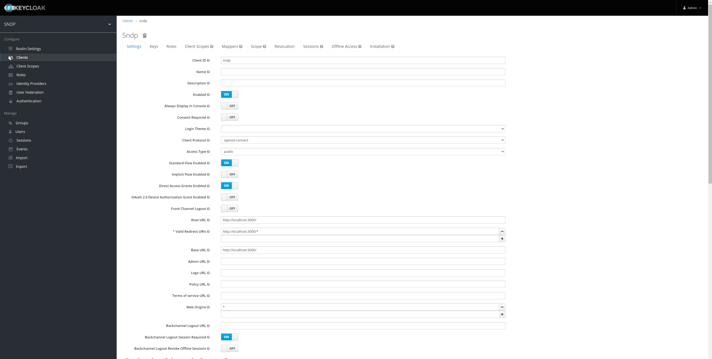

<h1 align="center">
  Streaming Network Data Platform
</h1>

Streaming Network Data Platform (**SNDP**) is a project which based on [chisel](https://github.com/jpillora/chisel) - TCP/UDP tunnel, transported over HTTP, secured via SSH. Integrate with API, store authen user with mysql or sqlite & interactive user dashboard ,...  

*Some of project use case*
- Host a website on Emmbed without opening ports on router.
- Fast delivery to public network from your private network (Testing without deploying)
- Running personal services from your home
- ...

## 🚀 Quick start
Build from source or use our latest release [release](https://github.com/lthnh15032001/SNDP/releases/tag/)

#### Build from source
```
make  build
```

**1.  Server**
   ```
    ./SNDP server --port [PORT] --reverse [--authfile ./users.json]
   ```
  ex: `./SNDP server --port 8081 --reverse`
The command runs a server on port 8081, which is responsible for hosting a server and accepting connections. For additional command customization, check out [chisel](https://github.com/jpillora/chisel)

**2. Client**
   ```
    ./SNDP client [serverIP] R:[SERVER_PORT]:[HOST]:[HOST_PORT]
   ```
  ex: `./SNDP client localhost:8081 R:55555:localhost:5555`
The command runs a client that connects to the above server and streams TCP data from localhost on port 5555 to port 55555 on the server.  For additional command customization, check out [chisel](https://github.com/jpillora/chisel)
**3. API**
   Make sure you have a database and keycloak by running `docker-compose up --d` (currently support `mysql` and `sqlite`), change connection information for adapting your requirement, we assume that keycloak running local at port `8080` and database mysql's port `3306` 

Setup keycloak (**`SNDP`** for realm name)

Make sure that `Access Type` is `public` and `Web Origins` is `http://localhost:3000` or `*`
#### Roles:
We use Keycloak for doing identity and access management.
List of role to configure for dashboard api:
- add-user
- get-user 
- get-tunnel

#### Github:
Create a [github oauth app](https://github.com/settings/developers) for keycloak.

Keycloak github identity provider setting:


#### Then run command for api server

   ```
    ./SNDP server api --e [dev|release]
   ```
   Default API running on port `9080`
**4. Dashboard**
   ```
    cd client
    yarn
    yarn run start
   ```
   **Dashboard Tunnel**
   
   **Dashboard User Authen to tunnel**
   

   Default API running at port `3000` & api request to the `API` above

